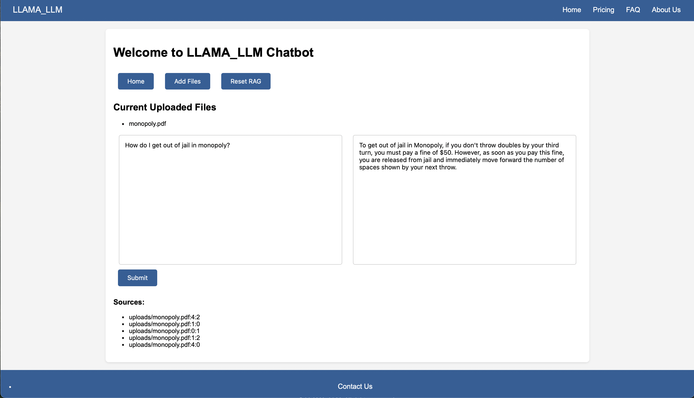

# LLAMA_LLM Chatbot

## Creating an End-to-End Document RAG Model Locally

This will be your project to create an end-to-end RAG model using your own documents with the use of Chroma locally. This application takes in PDF document uploads, creates document embeddings, and stores these in a vector database. Upon asking a question, it returns a set of relevant documents and uses the OllamaLLM model to generate a contextualized response.

A Flask application implementing Retrieval-Augmented Generation (RAG) using LangChain, Chroma, and OllamaLLM.

## Features

- **Upload PDFs:** Generate embeddings from your PDF documents.
- **Ask Questions:** Get context-aware answers based on your uploaded content.
- **Responsive Interface:** Seamless AJAX interactions without page reloads.
- **Security:** Secure file uploads with CSRF protection.

## USAGE
Upload Document:
Upload your document(s) in PDF format through the web interface.
The application processes and stores embeddings of your documents locally. 

Ask Questions: Type your question in the input box for answers. 

The app retrieves relevant information from your documents and generates an answer. 

Local Processing: All data processing, and model inference are done locally in your machine. This guarantees data privacy, and you can work independently without relying on any external services.

## Installation

### **Setting Up the Environment on macOS

python3 -m venv testenv
source testenv/bin/activate
pip install -r requirements.txt

### **Run in second terminal
Install OLLAMA locally first

ollama run llama3.2

### **Run FLASK application

python app.py

